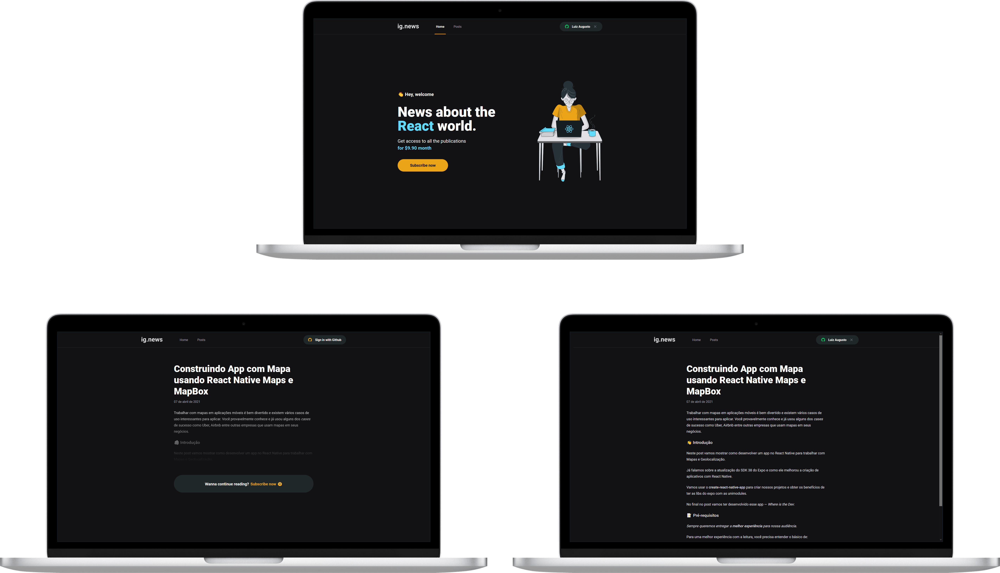

<p align="center">
    
</p>
</br>

# Ignite Project 03
Simple subscription-based blog and CNA (Create Next App) application idea made during Ignite ReactJS.

## 🔨 Features

→ Github OAuth Login/Logout ([**NextAuth.js**](https://next-auth.js.org))

→ Subscription-based blog with [**Stripe**](https://stripe.com) (**Webhooks**) and [**FaunaDB**](https://fauna.com) to save data

→ Served blog posts using [**Prismic CMS**](https://prismic.io)

→ SSG for public pages and SSR private pages (posts) with [**Next.js**](https://nextjs.org)

→ Styled Components & Global Style using [**Styled Components**](https://styled-components.com)

## 🚀 Techs & Tools
→ [**Next.js**](https://nextjs.org)

→ [**Stripe**](https://stripe.com)

→ [**FaunaDB**](https://fauna.com)

→ [**Prismic CMS**](https://prismic.io)

→ [**NextAuth.js**](https://next-auth.js.org)

→ [**TypeScript**](https://www.typescriptlang.org/)

→ [**Styled Components**](https://styled-components.com)

## 💻 Local Installation
```bash
# Open terminal and clone this repository
$ git clone https://github.com/luizwhite/ignite-ignews.git

# Create a .env.local file and add the requested environment variables
# based on the .env.example file in the project root

# Stripe, Prismic CMS and FaunaDB need your own account,
# and your own private/public access keys
# (it is assumed that you already know where to find them)

# Run stripe CLI listener (it is assumed that you already have it installed)
$ stripe listen --forward-to localhost:3000/api/webhooks

# Install dependencies
$ yarn

# Start the application
$ yarn start
```
